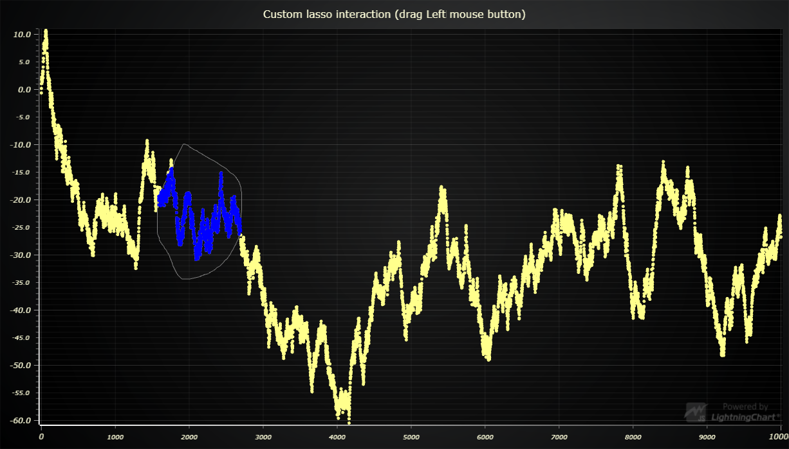
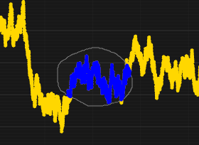

# JavaScript Lasso Selection Chart



This demo application belongs to the set of examples for LightningChart JS, data visualization library for JavaScript.

LightningChart JS is entirely GPU accelerated and performance optimized charting library for presenting massive amounts of data. It offers an easy way of creating sophisticated and interactive charts and adding them to your website or web application.

The demo can be used as an example or a seed project. Local execution requires the following steps:

- Make sure that relevant version of [Node.js](https://nodejs.org/en/download/) is installed
- Open the project folder in a terminal:

        npm install              # fetches dependencies
        npm start                # builds an application and starts the development server

- The application is available at *http://localhost:8080* in your browser, webpack-dev-server provides hot reload functionality.


## Description

This example showcases the creation of a custom user interaction.

By default, dragging left mouse inside the series area, a zoom/fit interaction is activated.
This default interaction can be disabled:

```js
chart
  // Disable default chart interactions with left mouse button.
  .setMouseInteractionRectangleFit(false)
  .setMouseInteractionRectangleZoom(false);
```

And any custom interaction can be implemented with different event subscription methods.
In this example, `ChartXY.onSeriesBackgroundMouseDrag` is used to hook on to the event when user drags their left mouse button inside the series area.
`PolygonSeries` are used to draw a _freeform lasso selection_ as the user moves their mouse on the chart.

The data points that are inside the lasso are solved in real-time, and highlighted with a separate `PointSeries`.



This idea of custom interactions can be extended to any application specific dynamic interaction, like deleting selected points, displaying them in a separate chart or moving them - imagination is the limit!

When implementing custom interactions that involve solving a list of data points from some selection - like lasso - optimizing the application side code is very important. Performing heavy computations inside event handlers can block the thread which can make it seem like the chart is not performing well when in reality it is the application code that is bottle-necking the performance.

Some rules of thumb for implementing custom interactions:

- **Don't do heavy calculations directly inside event handlers.** Instead, schedule an update using `setTimeout` and prevent recalculations happening more often than necessary. This example limits the lasso update to max. 1 update per 25 milliseconds.

- **Work smart, not hard.** In the case of lasso selection, iterating over a large data set one-by-one and checking which points are inside a _polygon_ can be _really heavy_.
  Instead, on each update, we only check the new expanded polygon area.
  In practice, the lasso polygon often has even 1000 coordinates in which case we're skipping 999 iterations of the entire data set every time the lasso is updated.

The code in this example is optimized very well, feel free to reference it in your own custom interaction implementations!


## API Links

* [Lightning chart]
* [Color factory CSS]
* [2D Point shape options]
* [Solid line style]
* [Solid fill style]
* [Points translation method]
* [Chart XY]
* [Point Series 2D]
* [Polygon Series 2D]


## Support

If you notice an error in the example code, please open an issue on [GitHub][0] repository of the entire example.

Official [API documentation][1] can be found on [Arction][2] website.

If the docs and other materials do not solve your problem as well as implementation help is needed, ask on [StackOverflow][3] (tagged lightningchart).

If you think you found a bug in the LightningChart JavaScript library, please contact support@arction.com.

Direct developer email support can be purchased through a [Support Plan][4] or by contacting sales@arction.com.

[0]: https://github.com/Arction/
[1]: https://www.arction.com/lightningchart-js-api-documentation/
[2]: https://www.arction.com
[3]: https://stackoverflow.com/questions/tagged/lightningchart
[4]: https://www.arction.com/support-services/

© Arction Ltd 2009-2020. All rights reserved.


[Lightning chart]: https://www.arction.com/lightningchart-js-api-documentation/v3.3.0/interfaces/lightningchart.html
[Color factory CSS]: https://www.arction.com/lightningchart-js-api-documentation/v3.3.0/globals.html#colorcss
[2D Point shape options]: https://www.arction.com/lightningchart-js-api-documentation/v3.3.0/enums/pointshape.html
[Solid line style]: https://www.arction.com/lightningchart-js-api-documentation/v3.3.0/classes/solidline.html
[Solid fill style]: https://www.arction.com/lightningchart-js-api-documentation/v3.3.0/classes/solidfill.html
[Points translation method]: https://www.arction.com/lightningchart-js-api-documentation/v3.3.0/globals.html#translatepoint
[Chart XY]: https://www.arction.com/lightningchart-js-api-documentation/v3.3.0/classes/chartxy.html
[Point Series 2D]: https://www.arction.com/lightningchart-js-api-documentation/v3.3.0/classes/pointseries.html
[Polygon Series 2D]: https://www.arction.com/lightningchart-js-api-documentation/v3.3.0/classes/polygonseries.html

